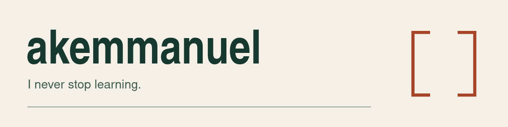

<picture>
  <source media="(prefers-color-scheme: dark)" srcset="assets/profile-dark.png">
  <source media="(prefers-color-scheme: light)" srcset="assets/profile-light.png">
  
</picture>

I build coding agents, desktop apps and small tools. Usually with TypeScript, Python and Bun.

[akemsoft.com](https://akemsoft.com/) · [Akemsoft](https://github.com/akemsoft)

## OpenGUI

My main project: an open-source desktop and web coding agent with its own host and harness, durable sessions, model connections and workspace tools.

[Visit the website](https://opengui.io) · [Explore the code](https://github.com/akemmanuel/OpenGUI) · [Get a release](https://github.com/akemmanuel/OpenGUI/releases)

## A few other things I've worked on

| Project | What it does |
| :--- | :--- |
| [VoiceAgent](https://github.com/akemmanuel/VoiceAgent) | A collaborative, experimental browser extension for voice conversations and browser tools. |
| [OpenCode PHP chat](https://github.com/akemmanuel/opencode-php-chat-ui) | A small PHP + ES5 chat interface that works on a Kobo e-reader. |
| [React slide deck](https://github.com/akemmanuel/react-slide-deck) | A minimal presentation shell that leaves the slide design to you. |
| [secscan](https://github.com/akemmanuel/secscan) | An experimental AI security-scanning agent. |

## Around the code

My repos include finished utilities, prototypes and older experiments; each project has its own scope and limitations.

If you find something useful or broken, open an issue in that project's repository.
